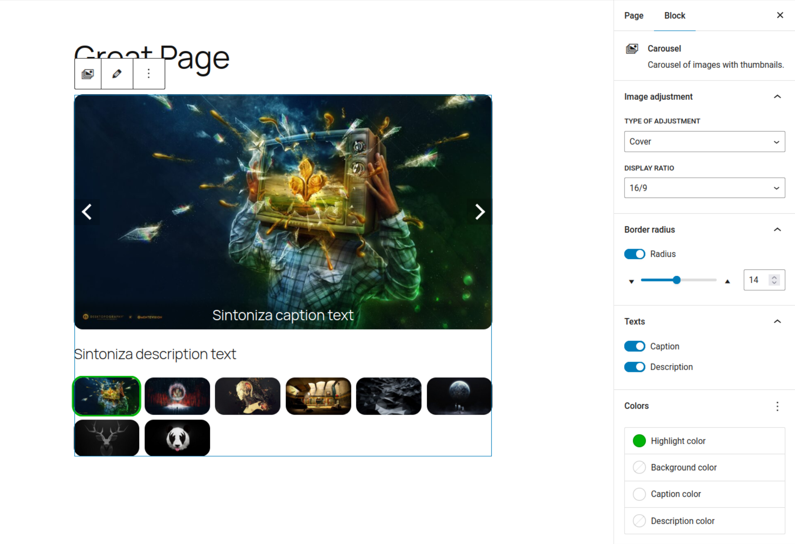

# Marciblocks Carousel

Marciblocks Carousel is a WordPress Gutenberg block plugin.

It's a simple, lightweight, high-performance image carousel that includes its own "image" block for nested blocks creation.

## Features

### Editor

- WYSIWYG rendering
- Multiple images selection
- Image order definition and editing
- Choice of border radius and value, if applicable
- Image adjustment
- Display ratio
- Choice of thumbnail highlight color
- Choice of caption display and color, if applicable
- Choice of description display and color, if applicable

### Front

- Lazy-loading of main images
- Tabbed navigation with images thumbnails
- Navigation with before/after controls
- Responsive display
- WAI-standard accessibility

More to come...

## Licence

This plugin is distributed under the **GNU General Public License v2.0 or later**.
You are free to use, modify and redistribute it under the terms of this license.

## Installation

### Dev environment

This Gutenberg block plugin is built using `@wordpress/create-block` toolkit; It involves notably NPM and WebPack, so in order to run the development mode, ensure you have Node.js installed. I personaly use Yarn as a package manager but you can use npm as well, of course.

In the project root you can then run :

- `yarn install` **FIRST** to install dependencies (it will create *node_modules* folder)
- `yarn start` to start watching files and compiling **JS** ones and transpiling **SCSS** ones
- `yarn build` to prepare the *build* folder files for deployment (minification and so on)

Enjoy! 😉

## Special notes

### Rendering in the editor

The carousel renders WYSIWYG in the editor, but without live navigation for performance reasons; As a result, only the first tab sees its data displayed (main image, caption, description) and the control and tab buttons don't work.



---

### Accessibility

A unique identifier per article/page is embedded in the carousel container markup so you can add as many carousels as you like; each carousel has its own target used as an accessibility scope.

```HTML
<!-- carousel N°1 -->
<section id="marciblocks-carousel-1"...>
    ...
    <!-- Main Images -->
    <div id="marciblocks-carousel-items-1"...>
        ...
    </div>
        <!-- Controls -->
        <div class="marciblocks-carousel-controls">
            <button aria-controls="marciblocks-carousel-items-1"...">
        ...

<!-- carousel N°2 -->
<section id="marciblocks-carousel-2"...>
    ...
    <!-- Main Images -->
    <div id="marciblocks-carousel-items-2"...>
        ...
    </div>
        <!-- Controls -->
        <div class="marciblocks-carousel-controls">
            <button aria-controls="marciblocks-carousel-items-2"...">
        ...
```

In the back-end, a subscription is made and an array of carousels present in the post/page is kept up to date, so that when, for example, the first carousel of the page is deleted, the second one becomes the first... This can be helpful for e.g. automatic numbering in titles.
